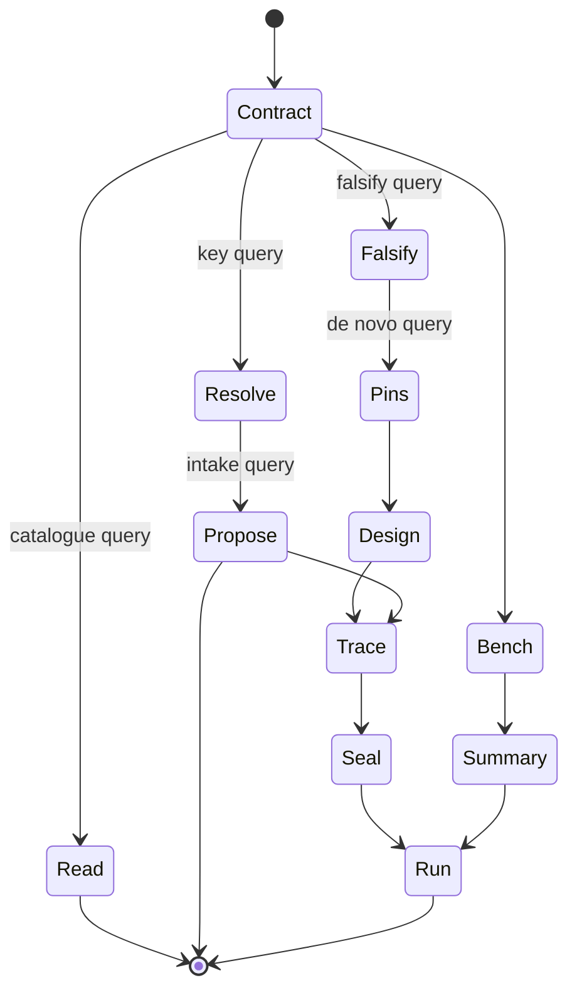
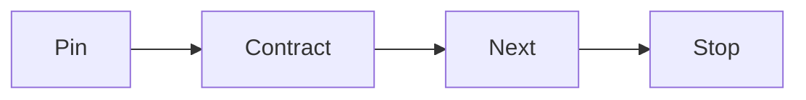

# catalog

`type: initialization` · non-normative. `docs/follow-agent-contract.md` governs on any conflict.

Route each task through the smallest sufficient path. The contract governs the folded templates.

## Specification

```json { type: notebook.cell }
{
  "id": "docs/read-repository.md",
  "type": "initialization",
  "role": "route tasks through the documentation DAG",
  "reads": ["DISCLAIMER", "graph.json", "neighbor Markdown on demand", "ooc/catalog.og"],
  "writes": [],
  "must": ["read DISCLAIMER first", "load the contract before any procedure", "treat absence as unknown"],
  "check": ["E1", "E6", "E7"]
}
```

## Graph

- → [follow-agent-contract.md](follow-agent-contract.md)

## Composition

```toml { type: notebook.cell }
root = "this file"
sink = "systems/run-campaign.md"
stop = "first sufficient route"
index = "ooc/catalog.og"
```

## Indications

| Task | Minimum read |
|---|---|
| read or rank rows | [`contract`](follow-agent-contract.md) |
| resolve a key | contract → [`resolve-key`](../skills/resolve-key.md) |
| propose a pair | contract → [`resolve-key`](../skills/resolve-key.md) → [`propose-pairs`](../skills/propose-pairs.md) |
| design | contract → [`falsify`](falsify.md) → [`pins`](pin-references.md) → [`design`](../skills/design-binder.md) → [`traces`](../systems/record-traces.md) → [`seal`](../systems/seal-og.md); [`bench`](../systems/use-bench.md) → [`record`](../tmp/record-egfr-calibration.md) → [`run`](../systems/run-campaign.md) |
| falsify | contract → [`falsify`](falsify.md) |
| traces | contract → [`traces`](../systems/record-traces.md) |
| organize agents | contract → [`falsify`](falsify.md); expand `template:*` |

Stop at the first sufficient row. Design continues to the sink. Index: `ooc/catalog.og`.

## Contraindications

- `graph.json` is evidence metadata, not a formulary, prescription, or ranking.
- `pair` and `preclinical` never pool. Absence is not evidence of no binder.
- Automation never discharges §8.16. An unread `pair` hit stops design.
- A collapsed fence stays closed until the route names its label.

## Algorithm

### Variables

```toml { type: notebook.cell }
objective = "select the smallest sufficient read-before route"

[independent]
task = "read | resolve | propose | design | falsify | organize"

[dependent]
route = "first sufficient Markdown path"

[controlled]
revision = "one pinned repository commit"
contract = "docs/follow-agent-contract.md"
```

### Process

```csv { type: notebook.cell }
operator,law
controls,one pinned commit
design,smallest task row
transport,next neighbor only
stopping,first sufficient node
search,task table match
filters,contract before any procedure
recovery,a refusal returns to the contract
```


```mermaid { type: notebook.cell }
stateDiagram-v2
    [*] --> Contract
    Contract --> Read: catalogue query
    Contract --> Resolve: key query
    Resolve --> Propose: intake query
    Contract --> Falsify: falsify query
    Falsify --> Pins: de novo query
    Pins --> Design
    Design --> Trace
    Propose --> Trace
    Contract --> Bench
    Trace --> Seal
    Seal --> Run
    Bench --> Summary
    Summary --> Run
    Read --> [*]
    Propose --> [*]
    Run --> [*]
```


```mermaid { type: notebook.cell }
flowchart LR
    Rev[Pin] --> Contract
    Contract --> Next
    Next --> Stop
```

Symbolic reasoning. `type: sandbox.playground`.

```tla
---- MODULE ReadRoute ----
CONSTANTS contract_first, sufficient
Stop == contract_first /\ sufficient
====
```

```lisp
(defun stop (contract-first sufficient)
  (and contract-first sufficient))
```

```lean
def lispStop (c s : Bool) : Bool := c && s

theorem Ti :
    (lispStop false false = false) ∧
    (lispStop false true = false) ∧
    (lispStop true false = false) ∧
    (lispStop true true = true) :=
  And.intro rfl (And.intro rfl (And.intro rfl (rfl)))
```

```bend
object Trace { name, holds }

def backward(ti_holds):
  if ti_holds:
    return Trace { name: "breakpoint", holds: 1 }
  else:
    return Trace { name: "refuse", holds: 0 }
```

## Citations

| Pin | Supports |
|---|---|
| [CommonMark 0.31.2](https://spec.commonmark.org/0.31.2/) | headings, lists, and links |
| [AgentKit, arXiv:2404.11483v2](https://arxiv.org/abs/2404.11483v2) | dependency DAGs |
| [AGENTS.md `d001185`](https://github.com/agentsmd/agents.md/tree/d001185d792eb6402a58e4cbef1c228b309ec25d) | path-local disclosure |

Retrieved 1 Nov 2026 (Australia/Sydney). Representation only.

## Falsification

| Challenge | Failure signal |
|---|---|
| Delete or reverse one graph edge | E6 rejects the route |
| Skip the contract | the oracle boundary is absent |
| Read a branch twice | bytes can differ |
| Treat a missing row as a negative | the file does not say that |
| Treat one green run as confirmation | a pass is not a contradicting observation |
| Remove the ReadRoute playground | E7 |

## Licence

MIT
